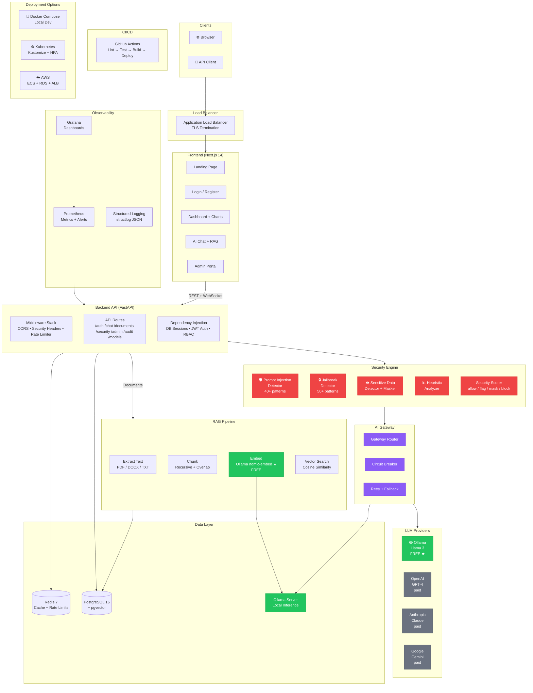
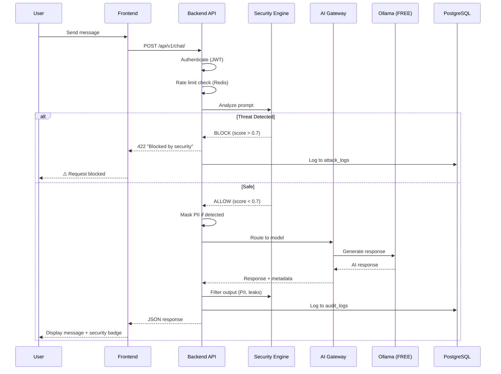
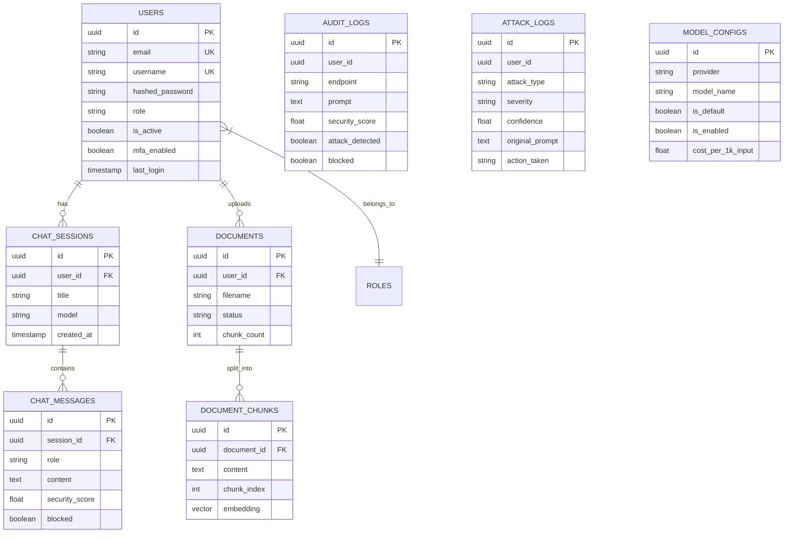
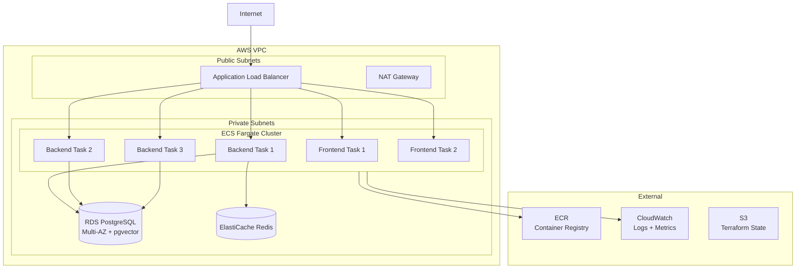

# SentinelAI Architecture Diagram

## System Overview

## Request Flow

## Data Model

## Deployment Architecture (AWS)

---

## How to View

1. **On GitHub** — These Mermaid diagrams render automatically when you view this file on github.com
2. **draw.io** — Open `sentinelai-architecture.drawio` at [app.diagrams.net](https://app.diagrams.net) for the full visual diagram with AWS icons
3. **Export** — From draw.io, export as PNG/SVG/PDF for presentations
